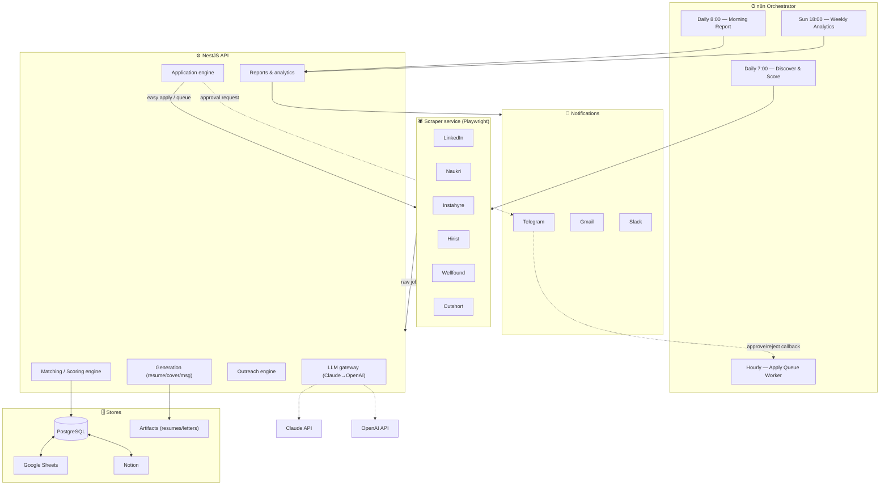
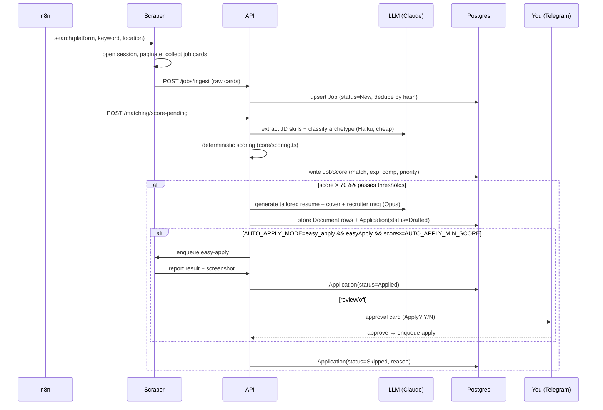

# 1. System Architecture

## 1.1 High-level overview

The system is a set of cooperating services orchestrated by **n8n** on a schedule. Postgres is
the single source of truth; everything else (Sheets, Notion, notifications) is a projection of it.

## 1.2 Service responsibilities

| Service | Tech | Responsibility |
|---------|------|----------------|
| **n8n** | n8n | Cron triggers, glue, retries, webhook approvals, fan-out per platform/keyword |
| **scraper** | Playwright + TS | Logs in via persisted session, searches, extracts JD, performs Easy-Apply, screenshots |
| **api** | NestJS | Scoring, LLM generation, application state machine, outreach, reports, mirrors |
| **core** | TS lib | Deterministic scoring (no LLM), shared types, profile loader |
| **integrations** | TS lib | Sheets / Notion / Telegram / Gmail / Slack clients |
| **postgres** | Postgres 16 | System of record |

## 1.3 The pipeline (data flow for one job)

## 1.4 Design principles

1. **Postgres is truth.** Sheets/Notion are eventually-consistent mirrors written after commit.
2. **Deterministic where possible.** Final scores come from `core/scoring.ts` (pure functions),
   not from the LLM. The LLM only *extracts* and *classifies*; it never decides the gate. This
   makes scoring auditable, reproducible, and cheap.
3. **Idempotency everywhere.** Every job has a stable `dedupeHash`. Re-running a day is safe.
4. **Human-in-the-loop is a first-class state**, not an afterthought — see the Application state
   machine in [docs/02](02-database-schema.md).
5. **Stateless services, stateful DB.** API and scraper can be killed/restarted anytime.
6. **Cost-tiered LLM.** Cheap model (Haiku) for high-volume extraction/scoring; expensive model
   (Opus) only for the handful of jobs that pass the gate and need generation.

## 1.5 Failure & resilience

- Scraper failures (selector drift, CAPTCHA, session expiry) → job marked `NeedsManual`, Telegram
  alert, run continues with other platforms.
- LLM failures → retry with backoff, then fall back Claude→OpenAI via the LLM gateway.
- Mirror (Sheets/Notion) failures → non-fatal; a reconciliation job re-syncs from Postgres.
- All outbound actions pass through a **rate limiter + kill switch** (`OUTBOUND_ENABLED`).
