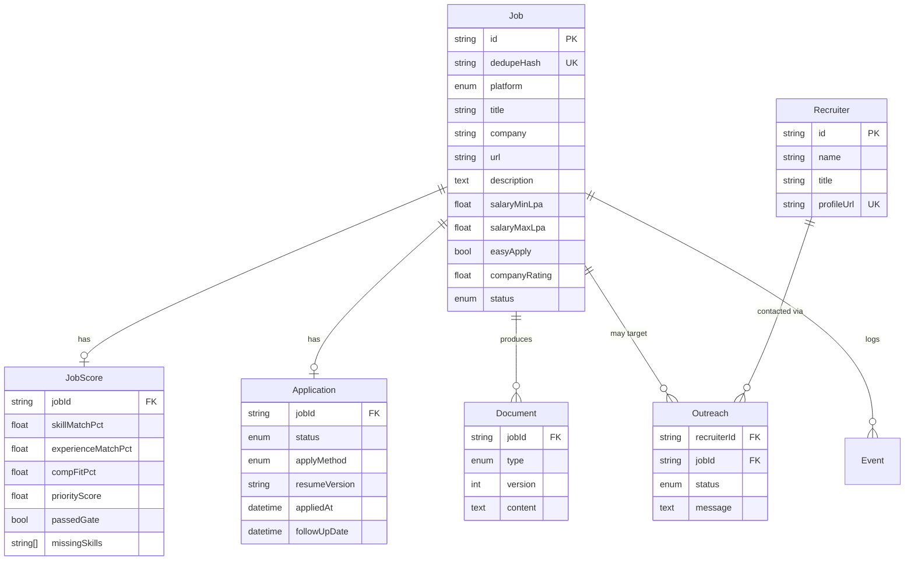
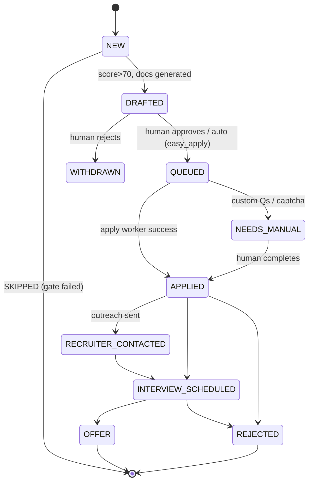

# 2. Database Schema

PostgreSQL 16. The authoritative definition is [`prisma/schema.prisma`](../prisma/schema.prisma);
a raw-SQL mirror is in [`db/init.sql`](../db/init.sql) (used by the Docker init + as documentation).

## 2.1 ER diagram

## 2.2 Tables

| Table | Purpose |
|-------|---------|
| `Job` | Every discovered posting. Deduped by `dedupeHash`. |
| `JobScore` | One score row per job (deterministic engine output). |
| `Application` | Application lifecycle / state machine per job. |
| `Document` | Generated artifacts (resume, cover, recruiter msg, custom answers), versioned. |
| `Recruiter` | People found for outreach. |
| `Outreach` | One row per (recruiter, job) contact attempt. |
| `Event` | Append-only audit log of every action. |
| `LlmUsage` | One row per LLM call → cost tracking. |
| `DailyMetric` | Pre-aggregated rollups for reports/analytics. |

## 2.3 The Tracking System mapping

The spec's tracking fields map directly onto the **`Job` + `JobScore` + `Application` + `Recruiter`**
join. This is what gets mirrored to Google Sheets / Notion (one row per job):

| Spec field | Source column |
|------------|---------------|
| Company | `Job.company` |
| Role | `Job.title` |
| Job URL | `Job.url` |
| Platform | `Job.platform` |
| Applied Date | `Application.appliedAt` |
| Resume Version | `Application.resumeVersion` → `Document.version` |
| Match Score | `JobScore.priorityScore` |
| Recruiter | `Recruiter.name` (via `Outreach`) |
| Follow-up Date | `Application.followUpDate` |
| Status | `Application.status` |

## 2.4 Application state machine

## 2.5 Key constraints & indexes

- `Job.dedupeHash` **UNIQUE** → idempotent ingestion; re-running a day never duplicates.
- `JobScore.priorityScore` indexed → fast "top N" for reports.
- `Application.followUpDate` indexed → daily "follow-ups required" query.
- `Event` is **append-only** (no updates/deletes) → full audit trail for every outbound action,
  which matters for the ToS-sensitive operations.
- `LlmUsage` → exact cost reconciliation against the estimate in [docs/08](08-cost-estimate.md).
