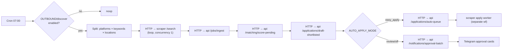
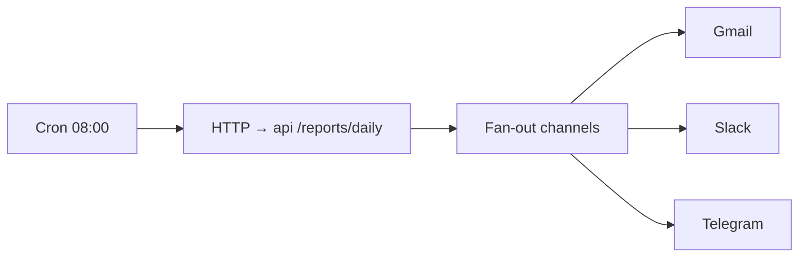

# 4. n8n Workflow

Three importable workflows live in [`n8n/workflows`](../n8n/workflows). n8n is the **orchestrator
and scheduler** only — it holds no business logic; it calls the API and scraper over HTTP and
fans out work.

Import: n8n UI → *Workflows* → *Import from File* → pick each JSON → set credentials → activate.

## 4.1 `daily-job-search` (Cron 07:00 IST)

**Steps**

1. **Cron** — 07:00 Asia/Kolkata.
2. **Guard** — `GET /config/flags`; abort if discovery disabled.
3. **Fan-out** — builds the cartesian product of enabled `{platform × keyword × location}` from
   `profile.json`, capped by `perPlatformSearchPagesPerRun`.
4. **Search** — for each combo, `POST scraper:/search` (concurrency 1, jittered). Scraper returns
   normalized job cards.
5. **Ingest** — `POST api:/jobs/ingest` (dedupe by hash, upsert).
6. **Score** — `POST api:/matching/score-pending` (LLM extract + deterministic scoring).
7. **Draft** — `POST api:/applications/draft-shortlisted` (generate docs for score>70).
8. **Branch on mode** — `easy_apply` → auto-queue; otherwise send Telegram approval cards.

## 4.2 `morning-report` (Cron 08:00 IST)

`GET api:/reports/daily` returns the rendered report (markdown + html + sections JSON). n8n fans
it out to the three channels. The report content matches the spec exactly (Applications Submitted,
Companies Applied, High Priority, Recruiters Contacted, New Jobs, Interview Probability Ranking,
Follow-Ups Required, Referral Opportunities, Top 5 Recommended).

## 4.3 `weekly-analytics` (Cron Sun 18:00 IST)

`GET api:/reports/weekly` → computes Applications Sent, Recruiter Replies, Interviews Scheduled,
Conversion Rate, Top Platforms, Resume Effectiveness, Highest Response Companies, plus
LLM-generated recommendations → fans out to the same channels.

## 4.4 `apply-queue-worker` (Cron every 30 min, business hours)

Pulls `Application.status=QUEUED`, respects `maxEasyApplyPerDay` and `minSecondsBetweenActions`,
calls `scraper:/apply`. On custom-question forms → `NEEDS_MANUAL` + Telegram alert.

## 4.5 Approval loop (webhook)

Telegram approval cards contain inline buttons → `POST n8n webhook /approve` →
`POST api:/applications/:id/decision {approve|reject}`. This is how human-in-the-loop is wired
without a custom UI. (A Next.js dashboard can replace the Telegram cards later.)

## 4.6 Why n8n (not cron + scripts)

- Visual retries, error branches, and per-node logging for a multi-step pipeline.
- Built-in credential vault for the channel integrations.
- Webhook nodes give the approval loop for free.
- Easy to pause the whole pipeline from one UI when a platform changes its markup.
