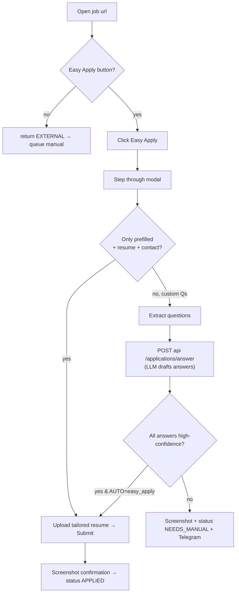

# 5. Playwright Automation

The scraper (`apps/scraper`) is the only ToS-sensitive surface. It is deliberately conservative:
non-headless, persisted real sessions, randomized human delays, hard rate caps, and it **stops on
any anti-bot challenge** rather than trying to defeat it.

## 5.1 Session strategy — no credential login

We do **not** automate username/password login (that is the fastest path to a ban and often
triggers 2FA/security checks). Instead:

```bash
pnpm scraper:login linkedin     # opens a real browser, YOU log in once, by hand
# → session persisted to storage-state/linkedin.json
```

`session.ts` opens a headed browser, waits for you to finish login + any 2FA, then saves
`context.storageState()`. Subsequent runs reuse cookies. When a session expires the scraper
flags `NeedsManual` and pings Telegram to ask you to re-login — it never re-enters credentials.

## 5.2 Adapter pattern

Every platform implements one interface (`platforms/base.ts`):

```ts
interface PlatformAdapter {
  readonly platform: Platform;
  search(ctx: BrowserContext, q: SearchQuery): Promise<RawJobCard[]>;
  extractJd(ctx: BrowserContext, url: string): Promise<JdDetail>;
  easyApply?(ctx: BrowserContext, job: ApplyTarget): Promise<ApplyResult>;
  findRecruiters?(ctx: BrowserContext, job: ApplyTarget): Promise<RecruiterLead[]>;
}
```

The CLI (`index.ts`) dispatches `search | apply | login` to the right adapter. The API talks to
the scraper over HTTP (small Express/Fastify wrapper) or invokes the CLI — both are supported.

## 5.3 Anti-detection that stays within "human-like", not "evasive"

| Technique | Why |
|-----------|-----|
| Headful (`HEADLESS=false`) | Headless is trivially fingerprinted; also it's honest behaviour |
| Persisted real session | No bot login pattern |
| Random delays `1.5–6s` between actions, `45s+` between applies | Mimics reading time, respects caps |
| Single concurrency per platform | No parallel hammering |
| Realistic viewport + locale (`en-IN`, `Asia/Kolkata`) | Matches the account's real profile |
| Scroll-to-element before click, `waitForLoadState` | Avoids race-y, robotic interaction |
| **Hard stop on CAPTCHA / checkpoint** | We never solve challenges — we pause + alert |

> We intentionally do **not** ship stealth-plugin fingerprint spoofing, residential proxy
> rotation, or CAPTCHA-solver integrations. Those cross from "personal automation" into
> "evasion", increase ban risk, and are out of scope. See [`DISCLAIMER.md`](../DISCLAIMER.md).

## 5.4 Easy-Apply flow (LinkedIn example)



## 5.5 Resilience

- **Selector drift:** each adapter uses role/text-based selectors first, CSS as fallback. On
  miss → screenshot + `NeedsManual`, never a blind click.
- **Timeouts:** global 30s nav timeout; per-action retries (2) with backoff.
- **Rate limiting:** a shared `RateLimiter` enforces `profile.limits` across the whole process
  and persists counters to Postgres (survives restarts; resets at local midnight).
- **Kill switch:** if `OUTBOUND_ENABLED=false`, `easyApply`/`findRecruiters` short-circuit and
  only `search`/`extractJd` (read-only) run.

## 5.6 Files

| File | Role |
|------|------|
| `browser.ts` | launch context from storage-state, human-delay helpers, rate limiter |
| `session.ts` | one-time interactive login + persist |
| `platforms/base.ts` | the adapter interface + shared parsing helpers |
| `platforms/linkedin.ts` | fully worked reference adapter |
| `platforms/{naukri,instahyre,hirist,wellfound,cutshort}.ts` | same interface, per-site selectors |
| `index.ts` | CLI dispatch + tiny HTTP server for the API/n8n |
