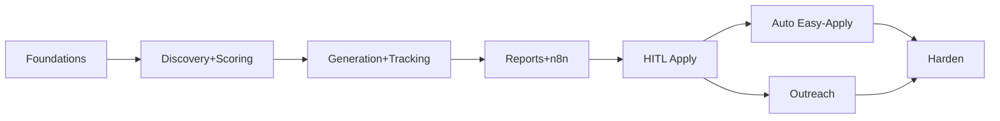

# 10. Full Implementation Plan

A phased plan that gets value early (discovery + scoring + reports) and adds risk-bearing
automation (apply, outreach) only after the safe core is proven. Each phase is shippable.

## Phase 0 — Foundations (½ day)
- [ ] `cp .env.example .env`; fill Anthropic key, Postgres, Telegram, Gmail.
- [ ] `docker compose up -d postgres n8n`.
- [ ] `prisma migrate deploy`; confirm tables (`db/init.sql` mirrors the schema).
- [ ] Fill `config/profile.json` + `config/resume-base.md` with **real** experience.
- **Exit:** DB is up; profile loads (`/config/flags` responds).

## Phase 1 — Discovery + Scoring (2–3 days) — *read-only, zero ToS risk beyond browsing*
- [ ] `pnpm scraper:login linkedin` (+ others you enable).
- [ ] Implement/verify each platform `search()` + `extractJd()` selector set (start with LinkedIn
      + Naukri; the others share the `makeAdapter` scaffold).
- [ ] Wire `POST /jobs/ingest` → dedupe → `POST /matching/score-pending`.
- [ ] Unit-test the scoring engine (`packages/core/src/scoring.test.ts`) against your profile.
- **Exit:** a daily manual run populates `Job` + `JobScore`; shortlist looks right by eye.

## Phase 2 — Generation + Tracking (2 days) — *still no outbound*
- [ ] `POST /applications/draft-shortlisted` → resume/cover/recruiter docs stored.
- [ ] Review 10 generated resumes for honesty + quality; tune `prompts/resume-tailor.md`.
- [ ] Stand up Sheets + Notion mirrors; run `tracking.syncAll()`.
- **Exit:** every shortlisted job has tailored docs + a tracker row in Sheets/Notion.

## Phase 3 — Reports + Orchestration (1–2 days)
- [ ] Import the 3 n8n workflows; set `API_BASE`/`SCRAPER_BASE` + channel creds.
- [ ] Activate `daily-job-search` (07:00) and `morning-report` (08:00); verify the digest lands
      via Email + Slack + Telegram and matches the spec's section order.
- [ ] Activate `weekly-analytics` (Sun 18:00).
- **Exit:** fully autonomous **discover → score → draft → report** loop, human-in-the-loop for
      anything outbound.

## Phase 4 — Human-in-the-loop Apply (2–3 days) — *first outbound; go slow*
- [ ] Set `AUTO_APPLY_MODE=review`, keep `OUTBOUND_ENABLED=false` and test the approval-card path
      (Telegram buttons → `/applications/:id/decision`).
- [ ] Flip `OUTBOUND_ENABLED=true` with tiny caps (`maxEasyApplyPerDay: 2`).
- [ ] Implement LinkedIn `easyApply()` end-to-end on 1–2 real, low-stakes postings; confirm
      screenshots + `Application.status=APPLIED`.
- [ ] Verify custom-question forms route to `NEEDS_MANUAL` + alert (they must not auto-submit).
- **Exit:** you approve from Telegram; the worker applies; confirmations are stored.

## Phase 5 — Selective Auto-Apply (1–2 days) — *highest risk; optional*
- [ ] `AUTO_APPLY_MODE=easy_apply`, `AUTO_APPLY_MIN_SCORE=85`, caps still small.
- [ ] Watch ban signals (challenges, empty results, warnings). Back off immediately if any appear.
- **Exit:** top-scoring Easy-Apply jobs auto-submit; everything else still queued for you.

## Phase 6 — Outreach (2 days) — *opt-in, rate-limited*
- [ ] Enable `platforms.linkedin.outreach`; implement `findRecruiters()`.
- [ ] Draft connection notes (already wired); **keep sending manual** until you trust the copy.
- [ ] Then allow sending under `maxConnectionRequestsPerDay` with human-like delays.
- **Exit:** recruiter leads captured, notes drafted, optional throttled sending.

## Phase 7 — Hardening & polish (ongoing)
- [ ] Prompt caching for the base resume; nightly Batch for JD extraction (cost).
- [ ] Selector-drift monitoring + alerts; weekly session-refresh reminder.
- [ ] Optional Next.js dashboard to replace Telegram approval cards.
- [ ] Backups (`pg_dump`), key rotation schedule, dependency updates.

## Build order summary

## Definition of done (per spec)
- ✅ Daily search across the 6 sources for the listed keywords/locations.
- ✅ Per-job match score, missing skills, interview probability, priority score; shortlist > 70.
- ✅ Apply gate: skill > 70%, experience ≥ 80%, comp likely-exceeds-current, frontend/fullstack role.
- ✅ Tailored resume + cover + recruiter message + custom answers, all stored.
- ✅ Easy-Apply automation; custom-question + flagged-for-review path.
- ✅ Recruiter discovery + personalized messages (opt-in sending).
- ✅ Postgres tracker mirrored to Sheets + Notion with the exact spec fields/statuses.
- ✅ 8 AM daily report (Email/Slack/Telegram) in the specified section order.
- ✅ Sunday weekly analytics with recommendations.
- ✅ All 9 design artifacts delivered in `docs/`.
